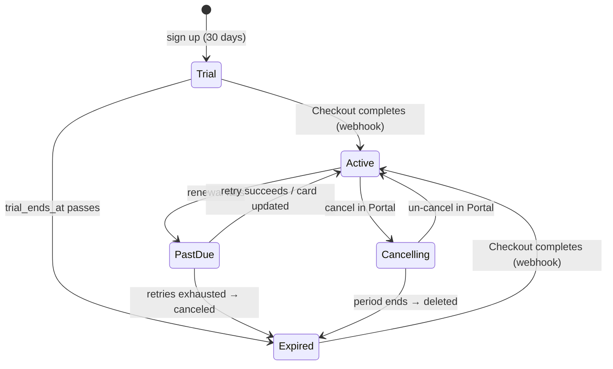

# BILLING — Marga

**Status:** live in Stripe live mode since 2026-09-25 · **Last updated:** 2026-09-25
**Also here:** complimentary access and the admin panel (§9, R-077); account deletion cancels the subscription first (§3.3, R-076)
**Requirements:** R-069 – R-074 ([PRD](PRD.md) §5.7) · **Decisions:** D-044 – D-050 ([EDD](EDD.md) §6)

Paid subscriptions through Stripe's hosted pages: **Checkout** to subscribe, the **Customer Portal** to change card, switch plan or cancel. There is no card form in the app, no free tier and no feature gating: every account has everything for 30 days, then needs a subscription.

---

## 1. Business rules

| Rule | Behaviour |
|---|---|
| Pricing | **$12/year** (default, emphasised, "Save 50%") or **$2/month** |
| Trial | 30 days from account creation. No card |
| Existing accounts | A fresh 30 days from when migration `0006_billing.sql` is applied |
| Subscribing mid-trial | The remaining trial carries into Stripe (`trial_end`), so the first charge is when the app trial would have ended. Under 48 hours left, Stripe charges immediately (its minimum) |
| After the trial | No live subscription → the app locks. The account page (billing, name, password, delete) and sign-out stay reachable |
| Lockout | Access is blocked; **data is never deleted**. Subscribing restores everything immediately |
| Payment failure | `past_due` keeps access while Stripe retries. Access ends when the subscription does (`canceled`, `unpaid`, `incomplete_expired`, `paused`) |
| Cancel | In the Portal, at period end. Access continues to the end of the paid period |
| Shared schedules | Access is per **caller**. A paying collaborator keeps a schedule whose owner lapsed; a lapsed collaborator loses shared schedules too |

Customer-facing terms (auto-renewal, cancellation, no refunds for partial periods) are on the public legal page, `public/legal.html` (R-075). It names no prices, trial length or retry schedule, so those can change here without touching it. It does promise a renewal reminder email before each yearly renewal, without naming a lead time: that is Stripe's "Send emails about upcoming renewals" (on), which Stripe sends **7 days** before every renewal (fixed; not configurable on this account), alongside its 7-day trial-ending reminder. **Known gap:** California's automatic-renewal law wants yearly-renewal notice 15–45 days ahead; 7 days is short of that. Accepted for now (2026-09-25) at this scale; closing it would mean sending our own email ~30 days before `current_period_end` for yearly subscribers.

**Out of scope:** coupons and promotion codes, team or multi-seat plans, Stripe Tax, custom emails (Stripe's built-in receipts only), trial-abuse prevention.

---

## 2. State model

Access is one function of two facts on `public.profiles`: the trial end, and the Stripe subscription status the webhook last recorded.

```
has_access = trial_ends_at > now()
          OR subscription_status IN ('active', 'trialing', 'past_due')
          OR comp_until > now()                  -- complimentary (0007); 'infinity' = forever
```

| App state | Condition | Access | Account page shows |
|---|---|---|---|
| **Trial** | no live status, `trial_ends_at` in the future | ✅ | "Free trial — N days left", upgrade buttons |
| **Active** | `active` | ✅ | Plan, "Renews {date}", Manage subscription |
| **Active, first charge pending** | `trialing` (subscribed mid-trial) | ✅ | Plan, "first charge on {date}" |
| **Active, cancelling** | `active` + `cancel_at_period_end` | ✅ | "Cancelled. Access until {date}" |
| **Past due** | `past_due` | ✅ | Red: "last payment failed … update your card" and a primary Manage button |
| **Expired** | anything else, trial over | ❌ lockout | "Trial ended" / "Subscription ended", upgrade buttons |



The rule lives in two places that must agree: `private.has_access()` in the database, which is authoritative, and `src/persist/access.ts`, which only chooses what to draw and is unit-tested against the same list.

---

## 3. Architecture

```
Browser ──(publishable key, user JWT)──► Supabase ── RLS + has_access() ──► data
   │                                          ▲
   │ POST /api/billing/checkout | portal      │ service role writes billing columns
   ▼                                          │
Vercel functions (api/billing/*) ──► Stripe ──┘ webhook: /api/billing/webhook (signed)
```

### 3.1 Where access is enforced

The browser talks to Supabase directly (D-037), so **the database is the server-side check**. It holds whatever the client does.

| Path | Enforcement |
|---|---|
| Reading schedules, the list, memberships | RLS on `projects` and `project_members` requires `private.has_access()` |
| Saving, the editor lock | `save_project`, `claim_editor` raise `PT402` → **HTTP 402** before anything else |
| Direct `insert`/`update`/`delete` on `projects` | RLS requires `has_access()`; nothing matches |
| Sharing | `share_project`, `set_member_role` raise `PT402`; `project_people` returns nothing |
| Realtime | Supabase Realtime applies the `select` policy to each subscriber, so a locked account receives no events |
| Page loads | The SPA bundle holds no data; with no access every query returns empty and the app draws `LockoutScreen` |
| Still allowed while locked | Read own profile, update `display_name`, account deletion (`/api/account/delete`), `remove_member` (leaving), sign-out, `/api/billing/*` |

The lockout screen is presentation only. A trial that ends mid-session is noticed by a one-minute clock in `App.tsx`, or by the first refused save (402 → re-read account → lockout).

### 3.2 Schema: `supabase/migrations/0006_billing.sql`

| Column on `profiles` | Written by | Notes |
|---|---|---|
| `trial_ends_at` | default / migration | `now() + 30 days` at creation; backfilled for existing rows |
| `stripe_customer_id` | checkout (`ensureCustomer`), webhook | `unique`; one Stripe customer per user |
| `stripe_subscription_id` | webhook | The subscription in effect |
| `subscription_status` | webhook | Stripe's status, verbatim |
| `plan` | webhook | `monthly` / `annual` / null, from the price's interval (was the `'free'` placeholder) |
| `current_period_end` | webhook | Next renewal, or last day when cancelling |
| `cancel_at_period_end` | webhook | True if `cancel_at_period_end` or `cancel_at` is set |
| `billing_synced_at` | webhook | When the written state was read from Stripe; guards against stale writes |
| `comp_until` | admin panel (`admin_set_comp`, 0007) | Complimentary access until this moment; `infinity` for no end; null for none |

Users keep `select` on their row and `update (display_name)` only, so every billing column is unwritable from the browser (verified by `npm run verify:db`). `public.stripe_events(id, type, received_at)` logs processed webhook events; it has RLS and no grants for `anon` or `authenticated`.

### 3.3 Endpoints (`api/billing/`)

| Endpoint | Auth | Does |
|---|---|---|
| `POST /api/billing/checkout` `{interval}` | `Authorization: Bearer <Supabase access token>`, checked with `auth.getUser` | Creates the Stripe customer once, or reuses it. Refuses with 409 if Stripe already has a live subscription for them. Returns a Checkout Session URL (subscription mode, price from env, `client_reference_id` and `subscription_data.metadata.user_id` = user id, `trial_end` when applicable) |
| `POST /api/billing/portal` | same | Customer Portal URL; 404 if no customer yet |
| `POST /api/billing/webhook` | Stripe signature over the raw body | The only writer of subscription state (§4) |
| `POST /api/account/delete` | Bearer token | Cancels every subscription that could still charge (immediately, unprorated), marks the customer `account_deleted_at`, **then** deletes the user. If Stripe fails → 502 and the account is kept. `delete_my_account` (the RPC) refuses with `PT409` while a subscription is live, so this is a subscriber's only way out |
| `GET` / `POST /api/admin/comp` | Bearer token **and** email in `ADMIN_EMAIL` (confirmed), else 403 | List grants; grant (`forever` or a date) or revoke (`null`) by email (§9) |

The browser sends an *interval*, never a price ID. Return URLs are `/?billing=success|cancel|portal`. On `success` the account page shows "Confirming…" and re-reads the profile every 2 s, for up to a minute, until the webhook has landed. **The redirect grants nothing.**

---

## 4. Webhook

### 4.1 Events handled

| Event | Why |
|---|---|
| `checkout.session.completed` | First subscription created |
| `customer.subscription.created` | Subscription exists (also from Dashboard/API) |
| `customer.subscription.updated` | Status, plan switch, cancel / un-cancel, trial → active |
| `customer.subscription.deleted` | Subscription ended → lock |
| `customer.subscription.paused` / `.resumed` | Pausing locks; resuming unlocks |
| `invoice.paid` | Renewal succeeded; recovers from `past_due` |
| `invoice.payment_failed` | Renewal failed; status becomes `past_due` |

Any other event gets a 200 and is ignored.

### 4.2 Processing (`api/billing/webhook.ts` → `api/_stripe.ts` `syncCustomer`)

1. **Verify** `Stripe-Signature` against `STRIPE_WEBHOOK_SECRET` over the raw body. On failure → 400, nothing parsed.
2. **Dedupe**: if the event id is in `stripe_events` → 200 `duplicate`.
3. **Re-read, don't trust the payload.** List the customer's subscriptions from Stripe and pick the one in effect (most live, then newest; `pickSubscription`). Write its columns to the profile matched by `stripe_customer_id`, falling back to customer `metadata.user_id`.
4. **Record** the event id → 200. Any failure before this → 500, so Stripe retries.

**Idempotency and ordering.** Step 3 is a full sync from Stripe's current state, so repeating it, or running it for an old event, writes the same thing. For two deliveries processed at once, each write is stamped with when its Stripe read began (`billing_synced_at`). A write older than the stored stamp is dropped, so a stale read can never overwrite a newer one.

---

## 5. Environment variables

All server-only. None is `VITE_`-prefixed, so none can reach the bundle.

| Variable | What | Production | Preview | Development |
|---|---|---|---|---|
| `STRIPE_SECRET_KEY` | `sk_test_…` now, `sk_live_…` at launch (Production only) | ✅ | ✅ (test) | ✅ (test) |
| `STRIPE_WEBHOOK_SECRET` | `whsec_…` of the endpoint that calls this deployment | ✅ Dashboard endpoint | optional¹ | local `.env.local` from `stripe listen`² |
| `STRIPE_PRICE_MONTHLY` | `price_…` of the $2/month price | ✅ | ✅ | ✅ |
| `STRIPE_PRICE_ANNUAL` | `price_…` of the $12/year price | ✅ | ✅ | ✅ |
| `SUPABASE_URL` | Same value as `VITE_SUPABASE_URL` | ✅ | ✅ | ✅ |
| `SUPABASE_SECRET_KEY` | `sb_secret_…` (bypasses RLS) | ✅ | ✅ | ✅ |
| `ADMIN_EMAIL` | The admin's account email (comma-separate for more than one). Server-only on purpose: the page asks `/api/admin/comp` and gets 403 unless admin, so the email never ships in the bundle | ✅ | optional | optional (`.env.local`) |

¹ Preview URLs change every deployment and are behind Vercel Deployment Protection, so Stripe can't reach them by default. Without a preview webhook, Checkout works on a preview but the subscription never shows as confirmed. Add one only if you need end-to-end billing on previews: a test-mode endpoint on a stable branch alias, plus a protection bypass.
² `stripe listen` prints a secret that stays stable per machine and login. Keep it in `.env.local`, not Vercel.

Price IDs aren't secret, but they stay server-side so the client can't choose a price.

---

## 6. Stripe Dashboard setup

Do all of this in **test mode** first. At launch, repeat it in live mode and swap the Production env vars.

1. **Business details:** Settings → Business → public business name, statement descriptor, support email. Checkout needs these.
2. **Product and prices:** Product catalogue → *Add product* "Marga".
   - Recurring price **$2.00 USD / month**. Copy its `price_…` → `STRIPE_PRICE_MONTHLY`.
   - Add another price on the same product: **$12.00 USD / year**. Copy it → `STRIPE_PRICE_ANNUAL`.
3. **Webhook:** Developers → Webhooks → *Add endpoint*.
   - URL `https://marga-planner.vercel.app/api/billing/webhook`
   - Events: the eight in §4.1
   - API version: the account default is fine. The handler reads only `customer` from the payload and re-fetches the rest with the SDK's pinned version (`2026-08-26.dahlia`)
   - Copy the signing secret → `STRIPE_WEBHOOK_SECRET` (Production)
4. **Customer Portal:** Settings → Billing → Customer portal.
   - Payment methods: allow updating ✅
   - Invoice history ✅
   - Cancel subscriptions ✅ → **At the end of the billing period**. The cancellation-reason survey is optional
   - Switch plans ✅ → add product *Marga* with both prices; proration: *prorate* (Stripe default)
   - Update customer details: optional. Leave email change off: the sign-in email is managed in the app
   - Links: terms and privacy URLs if you have them
   - Save. The Portal errors until it has been saved once in each mode
5. **Failed payments:** Settings → Billing → Subscriptions and emails.
   - Smart Retries on (default: up to 8 attempts over 2 weeks)
   - *If all retries for a payment fail* → **Cancel the subscription**. This ends `past_due` with a lockout. *Mark as unpaid* also locks, but leaves a subscription to recover; cancel is cleaner
   - Optional, and still Stripe's own emails: "Send emails when card payments fail", "Send reminders for expiring cards"
6. **Email receipts:** Settings → Business → Customer emails → turn on **Successful payments** (and **Refunds**). Stripe doesn't send receipts automatically in test mode; send one manually from a payment to preview it.
7. **Branding:** Settings → Branding. Logo, and accent `#4f5bd5` to match the app. Used by Checkout, the Portal and receipts.

### 6.1 Live configuration (2026-09-25)

Production went straight to live mode; test mode has no Marga product yet, so Preview and Development have no Stripe variables and their Upgrade buttons say "Billing is not configured."

| Object | Live ID | Notes |
|---|---|---|
| Product | `prod_VKCmaycxjsk8pP` "MARGA" | |
| Monthly price | `price_1UJYMUAZYCorrR3j9W4yBeQu` | $2.00/month, nickname `marga-monthly` → `STRIPE_PRICE_MONTHLY` |
| Annual price | `price_1UJYMUAZYCorrR3jRpT7MmPu` | $12.00/year, nickname `marga-annual` → `STRIPE_PRICE_ANNUAL` |
| Customer Portal | `bpc_1UJYbDAZYCorrR3jJJENuHjU` | The account default, created through the API. Card update, invoice history, cancel at period end with a reason survey, switch between the two prices with proration, trial kept on switch, customer details locked. Terms and privacy URLs point at `/legal.html` |
| Webhook endpoint | `we_1UJYbmAZYCorrR3jOuaD4hio` | `https://marga-planner.vercel.app/api/billing/webhook`, the eight §4.1 events, account-default API version. Secret rolled after setup |

The same Stripe account also takes closemytab.app donations, so business name, statement descriptor and branding are shared between the two (a deliberate choice, 2026-09-25).

---

## 7. Testing

### 7.1 Automated

| Command | Covers |
|---|---|
| `npm test` | `src/persist/access.test.ts`: state model. `api/_billing.test.ts`: subscription choice, column mapping, trial carry-over, price mapping. `api/_webhook.test.ts`: forged/missing signature → 400, sync + record, duplicate skipped, unhandled ignored, failure → 500 then retry succeeds |
| `npm run verify:db` | Live database: billing columns unwritable by users; `stripe_events` invisible; expired trial → no reads, 402 on save / lock / create / share, no realtime events, profile still readable. Collaborator keeps a lapsed owner's schedule; a lapsed collaborator loses it. `active` restores with data intact; `past_due` keeps access; `canceled` / `unpaid` / `incomplete_expired` lock |

### 7.2 Local setup with the Stripe CLI

```bash
# .env.local needs: VITE_SUPABASE_URL, VITE_SUPABASE_PUBLISHABLE_KEY, SUPABASE_URL,
# SUPABASE_SECRET_KEY, STRIPE_SECRET_KEY (sk_test_…), STRIPE_PRICE_MONTHLY, STRIPE_PRICE_ANNUAL
stripe login
stripe listen --forward-to localhost:5173/api/billing/webhook   # prints whsec_… once
# put that whsec_… in .env.local as STRIPE_WEBHOOK_SECRET, then:
npm run dev                                                      # also serves api/ (vite.config.ts)
```

Test cards (any future expiry, any CVC): `4242 4242 4242 4242` succeeds; `4000 0000 0000 0341` attaches but every charge fails; `4000 0025 0000 3155` requires 3-D Secure.

Useful SQL, run in the Supabase SQL editor. `<USER>` is the account's `auth.users.id`:

```sql
select trial_ends_at, subscription_status, plan, current_period_end, cancel_at_period_end, stripe_customer_id
from public.profiles where id = '<USER>';
update public.profiles set trial_ends_at = now() - interval '1 minute' where id = '<USER>';  -- expire trial
```

### 7.3 Paths to verify

| # | Path | Steps | Expect |
|---|---|---|---|
| 1 | Signup gets a trial | Create an account | Account page: "Free trial — 30 days left"; `trial_ends_at` ≈ now + 30 d |
| 2 | Trial expiry locks | Expire the trial (SQL above), reload | Lockout screen; account page and sign-out still work |
| 3 | Locked user can't write via the API | See §7.4 | 402 / empty results |
| 4 | Subscribing unlocks | Lockout → *Annual* → pay with `4242…` | Back on the account page: "Confirming…", then "Annual — $12/year"; `stripe listen` shows 200s; schedules return |
| 5 | Mid-trial subscribe keeps the trial | New account (trial > 2 days) → *Monthly* → `4242…` | Status `trialing`; "first charge on {trial end}"; no charge in Dashboard yet |
| 6 | Cancel locks at period end | Test clock (§7.5) → *Manage subscription* → cancel → advance the clock past the period end | "Cancelled. Access until …" while it runs; after the advance, `customer.subscription.deleted` → lockout |
| 7 | Failed payment keeps access during retries | Test clock → in Portal replace card with `4000…0341` → advance past the period end | `invoice.payment_failed`, `past_due`: access kept, red warning. Advance ~3 weeks → retries exhausted → canceled → lockout |
| 8 | Webhook security and idempotency | Resend an already-processed event (Dashboard → Developers → Events → *Resend*, or `stripe events resend evt_…`); `curl -X POST localhost:5173/api/billing/webhook -d '{}'` | Resend → `{"duplicate":true}` and no change; unsigned → 400 |
| 9 | Plan switch | Portal → switch monthly ↔ annual | Account page shows the new plan after returning |

### 7.4 Direct API check (locked account)

Get the access token from the browser (DevTools → Application → Local Storage → `sb-<ref>-auth-token` → `access_token`). Then:

```bash
URL=<VITE_SUPABASE_URL>; KEY=<VITE_SUPABASE_PUBLISHABLE_KEY>; TOKEN=<access_token>
curl -s -w '\n%{http_code}\n' "$URL/rest/v1/rpc/save_project" \
  -H "apikey: $KEY" -H "Authorization: Bearer $TOKEN" -H 'content-type: application/json' \
  -d '{"p_id":"probe","p_name":"x","p_data_date":"2026-09-24","p_tasks":[],"p_links":[],"p_updated_at":null,"p_client_id":"curl"}'
# → {"code":"PT402",…,"message":"payment_required"}  402
curl -s "$URL/rest/v1/projects?select=id" -H "apikey: $KEY" -H "Authorization: Bearer $TOKEN"
# → []
```

### 7.5 Test clocks, for paths 6 and 7

Test clocks move a customer through time without waiting. The app creates customers itself, so link a clock-bound customer to the test account by hand:

```bash
stripe test_helpers test_clocks create --frozen-time $(date +%s) --name marga
stripe customers create --email <account email> --test-clock <clock_id> -d "metadata[user_id]=<USER>"
```
```sql
update public.profiles set stripe_customer_id = '<cus_id>' where id = '<USER>';
update public.profiles set trial_ends_at = now() - interval '1 minute' where id = '<USER>';
```
Subscribe in the app (Monthly, `4242…`), then advance:
```bash
stripe test_helpers test_clocks advance <clock_id> --frozen-time <unix time just past current_period_end>
```

---

## 8. Operations

- **Ship order:** the code can deploy before the migration. With the billing columns missing, the app treats billing as unknown and locks nobody out, and the billing section shows a neutral note. Then: Stripe setup (§6) → env vars (§5) → redeploy, so the functions see the vars → apply `0006_billing.sql`. The migration is the switch: it starts every existing account's 30 days and turns on enforcement, so apply it when you mean it.
- **Going live:** done 2026-09-25 (§6.1). The live `STRIPE_SECRET_KEY`, `STRIPE_WEBHOOK_SECRET` and price IDs are in **Production only**. To give Preview and Development billing, create the product and prices in test mode and set the test values there.
- **Deleted accounts:** the customer stays in Stripe (payment history) with `metadata.account_deleted_at`; its subscriptions are cancelled. Later webhook events for it are logged as "belongs to a deleted account" and answered 200.
- **Display prices** are in `src/persist/access.ts` (`PRICES`). Keep them in step with the Stripe prices; the charge always comes from the price ID.
- **A stuck account:** re-send any recent event for that customer from the Dashboard (Developers → Events → Resend). The handler re-syncs from Stripe's current state, so any event for the customer fixes it.
- **Refunds and disputes** are handled in the Dashboard. A refund doesn't change access; cancel the subscription too if access should end.

---

## 9. Complimentary access

Free, full access for the owner and friends, with no Stripe involvement: no price, no coupon, no $0 subscription.

| | |
|---|---|
| Where | `profiles.comp_until` (migration 0007): a moment, `infinity` (forever), or null. Part of `private.has_access()`, so the database honours it everywhere |
| Who sets it | Only the admin, from **Account → Admin → Manage free accounts**. The panel appears when `/api/admin/comp` answers 200, which it does only for a confirmed account whose email is in `ADMIN_EMAIL`. Users can't write the column (grant is `display_name` only), and `admin_set_comp` / `admin_comp_accounts` are executable by the service role only |
| How | Enter the email of an existing account (they sign up first), choose *Forever* or *Until* a date, *Grant*. *Revoke* sets it back to null; the account falls back to trial, subscription or lockout |
| What they see | "Complimentary access — Free, with no end date" (or "until {date}"), no upgrade buttons. A live subscription shows instead of comp, so they can still cancel it; the admin list flags anyone who is also paying |
| Without the panel | Supabase SQL editor: `select public.admin_set_comp('friend@example.com', 'infinity');` (or a timestamp, or `null`) |

